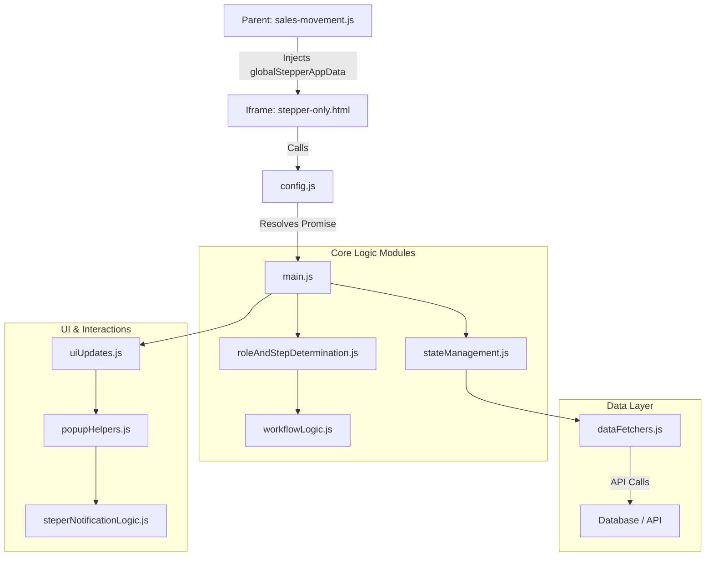

# Stepper System Details

This document explains the technical and functional details of the Stepper system used in the sales movement page, based on the current programming structure in the `steper/` directory.

---

## 1. Item Statuses
The system provides 7 basic statuses for each product within an order, controlled via `steper/config.js`:

| Status        | Status Key  | Description                                                      |
| :------------ | :---------- | :--------------------------------------------------------------- |
| **Pending**   | `PENDING`   | Default status when starting or reviewing an order.              |
| **Confirmed** | `CONFIRMED` | Product is available and accepted by the seller.                 |
| **Shipped**   | `SHIPPED`   | Product has been delivered to the courier or physically shipped. |
| **Delivered** | `DELIVERED` | Purchaser has received the product and confirmed it.             |
| **Cancelled** | `CANCELLED` | Product cancelled by the purchaser during review.                |
| **Rejected**  | `REJECTED`  | Product rejected by the seller (unavailable).                    |
| **Returned**  | `RETURNED`  | Product reached the purchaser but was not received (returned).   |

---

## 2. Roles & Permissions Matrix
The user's role is determined in `steper/roleAndStepDetermination.js` in the following order: Admin > Seller > Buyer > Courier.

| Role        | Permission                | Notes                                                                          |
| :---------- | :------------------------ | :----------------------------------------------------------------------------- |
| **Admin**   | Full Access               | Can modify any stage and override all locks. Identified via `ADMIN_IDS`.       |
| **Buyer**   | Review and Delivery       | Controls the `Review` and `Delivered` stages.                                  |
| **Seller**  | Confirmation and Shipping | Controls the `Confirmed` and `Shipped` stages for their own products only.     |
| **Courier** | Shipping and Delivery     | Views seller details for order aggregation, and confirms shipping or delivery. |

### 2.1. Role Determination Algorithm
The `determineUserType` function in `roleAndStepDetermination.js` relies on precise logic to avoid permission conflicts:

1.  **Admin:** First checked against the `ADMIN_IDS` array in `config.js`. If the user is in it, `admin` permission is granted immediately.
2.  **Seller:** Searched within `order_items`. If an item's `seller_key` matches the current user ID, they are considered a seller.
3.  **Buyer:** Searched in `ordersData`. If `user_key` matches the user ID, they are considered a buyer.
4.  **Courier:**
    *   The `supplier_delivery` field for each item is checked.
    *   The system supports this field being an object `{ delivery_key: '...' }` or an array.
    *   The `delivery_key` is extracted and matched with the current user.
5.  **Conflict Handling:**
    *   If the system detects the user is both a "seller" and a "buyer" for the same order (a logical error), `null` is returned and a `Fatal Error` is logged.
    *   Priority order: Admin > Seller > Buyer > Courier.

---

## 3. Steps Timeline

| #     | Step          | Function                                    | Activation Mechanism                               |
| :---- | :------------ | :------------------------------------------ | :------------------------------------------------- |
| **1** | **Review**    | Determining products to be purchased.       | Automatic upon order creation.                     |
| **2** | **Confirmed** | Sellers confirming product availability.    | Manually via (Activate Step) toggle in the window. |
| **3** | **Shipped**   | Confirming products have left for shipping. | Manually, requires stage 2 to be active.           |
| **4** | **Delivered** | Final receipt confirmation.                 | Manually, requires stage 3 to be active.           |

> [!IMPORTANT]
> **Step Sequence:** A stage cannot be activated unless the previous stage is active (Sequence: 1 -> 2 -> 3 -> 4) via the `validateStepSequence` function.

---

## 4. Modular Architecture
The code has been divided into modules for ease of maintenance:

*   **Controllers:** Located in `buyerPopups/` and `sellerPopups/` to control the logic of opening windows and saving data.
*   **Logic:** `buyerLogic.js` and `sellerLogic.js` for data processing (Pure Functions).
*   **UI:** `buyerUi.js` and `sellerUi.js` to generate HTML code for windows.
*   **State:** `stateManagement.js` to manage order state in memory and synchronize it with the server.
*   **Data Fetchers:** `dataFetchers.js` to handle the API and communicate with the database.

---

## 5. Lock Mechanisms
To prevent tampering after final saving, stages are locked for each user independently:

*   **Confirmation Lock:** `__confirmation_locked_{sellerId}__` - Prevents the seller from changing their mind after confirming products.
*   **Shipping Lock:** `__shipping_locked_{userId}__` - Prevents the seller/courier from modifying shipping status after saving.
*   **Delivery Lock:** `__delivery_locked_{userId}__` - Prevents the purchaser from modifying delivery status after saving.

> [!TIP]
> The Admin is the only one who sees buttons even if the stage is locked, allowing for emergency modifications.

---

## 6. Special Service Features

### 6.1. Order Service Footer
Appears at the bottom of the Stepper for service orders only (`orderType === 1`) and contains:
*   **Image Link:** Allows viewing special order attachments.
*   **Order Value Input:** A numeric field to display and modify the total order amount.
*   **Save Button:** A dedicated button to commit the value to the server.

### 6.2. Price Management & Smart Locks
The value field is linked to the `total_amount` column in the database and is subject to strict rules:
*   **Confirmation Window:** When clicking save, a `SweetAlert2` window appears to confirm the value before sending it to the server.
*   **Seller Auto-Lock:** The field is locked (Read-only) and the save button is disabled for the seller as soon as the order moves to the **"Confirmed"** stage or beyond. A "Value locked after confirmation" alert appears upon interaction attempt.
*   **Admin Permission:** The Admin is the only one who retains the authority to modify and save the value at any time, even after order confirmation, to correct errors.
*   **Buyer and Courier:** The field is available to them for viewing only and they cannot interact with it at all.

### 6.3. Auto-Scroll Tutorial
When opening the Stepper page for the first time (or twice), the bar automatically scrolls right and left to introduce the user to the existence of other stages accessible by swiping.

---

## 7. Stepper Data Structure & Flow

The system currently relies on the principle of **"Single Source of Truth"**. Local storage has been completely eliminated, and the UI state only changes after receiving a `200 OK` response from the server.

### `order_status` Field Structure
All statuses are stored within a composite text field in the database in the format:
`StepID # Timestamp # JSON_Blob`

| Component     | Description                                                        | Example                    |
| :------------ | :----------------------------------------------------------------- | :------------------------- |
| **StepID**    | Identifier of the last activated main stage.                       | `step-confirmed`           |
| **Timestamp** | Timing of the last system update.                                  | `2024-12-21T09:00:00.000Z` |
| **JSON_Blob** | A flexible object containing technical statuses, locks, and dates. | See example below          |

### Expected `JSON_Blob` Contents:
```json
{
  "1734057973789": "confirmed",
  "1734057973790": "rejected",
  "__confirmation_locked_1024182175__": "locked",
  "__confirmation_locked_5502654655__": "locked",
  "__shipping_locked_1024182175__": "locked",
  "__date_step-confirmed__": "2024-12-15 10:00 PM",
  "__date_step-shipped__": "2024-12-16 09:30 AM"
}
```

### Data Flow Scenarios:

1.  **Page Load (Initialization):**
    *   `order_status` is received and dismantled in `stateManagement.js`.
    *   Item statuses are distributed to local memory and Timeline dates are populated based on `__date_` keys.

2.  **Saving Updates:**
    *   When an item status or stage lock changes, a `POST` request is sent to the server.
    *   New values are merged into the existing JSON in the database to ensure other users' data is not lost.

3.  **Step Activation:**
    *   An "Activation Date" is recorded under the `__date_{stepId}__` key and saved in the Blob.
    *   The stage status in the progress bar turns to "Active" and the date appears below it.

4.  **Error Handling:**
    *   In case of connection failure, local memory or the UI is not updated, and an error message (Swal) appears to the user, ensuring full alignment with the server state.

---

## 8. Localization & Arabic Support

The system is designed to fully support Arabic (RTL) in all pop-up windows and interfaces, with a strict localization policy preventing English terms from appearing to the end-user.

### Status Translation Mechanism
Statuses are stored programmatically in English (e.g., `pending`) to ensure database stability, but are displayed in Arabic to the user via:
*   **Unified Translation Dictionary:** `ITEM_STATUS_ARABIC` in `config.js`.
*   **Conversion Function:** `translateStatus(status)` in `commonUtils.js` which converts any technical key to its Arabic equivalent.

### Date and Time Localization
The `formatDate` function in `uiUpdates.js` uses an Arabic timing system:
*   Converting `AM` to **"ص"**.
*   Converting `PM` to **"م"**.
*   The date appears in `YYYY-MM-DD` format followed by time in 12-hour format.

### UI Strings
All display messages within `buyerUi.js` and `sellerUi.js` have been localized to ensure a user experience free of any English words, including "No products" messages and save alerts.

---

## 9. Data LifeCycle Deep Dive

This section explains the full journey of data from the database until it reaches the Stepper interface.

### 9.1. Primary Responsibility & Data Injection

The page [`pages/sales-movement/sales-movement.js`](file:///c:/Users/hesham/bazaar/pages/sales-movement/sales-movement.js) is the **primary responsible and first driver** of the data lifecycle within the Stepper. The Stepper system does not fetch order data from the server independently at start; it relies entirely on data prepared and injected from the sales movement page.

#### Key tasks performed by `sales-movement.js`:

1.  **Fresh Fetching:**
    *   When any order is clicked, the page fetches the latest version of data via API: `/api/user-all-orders`.
    *   This step ensures the Stepper will display the real and final status of the order (Real-time Sync).

2.  **Order Type Identification:**
    *   The page passes the `orderType` field (0 for products, 1 for services).
    *   This field is responsible for programmatically changing the Stepper's behavior (e.g., showing or hiding the image link and pricing tools).

3.  **Data Transformation:**
    *   The `salesMovement_showOrderDetails` function prepares the `convertedOrder` object.
    *   Data discrepancies (e.g., the `supplier_delivery` field) are processed to ensure unified data reaches the Iframe without causing failures.

4.  **Technical Bridging:**
    *   Data is injected via the global object `window.globalStepperAppData` in the parent window.
    *   This object contains the user ID (`idUser`), orders array (`ordersData`), and base URL (`baseURL`).

> [!IMPORTANT]
> Any failure in sending data from the sales movement page will directly lead to the Stepper stopping or displaying inaccurate data, as it functions as a passive receiver of data.

### 9.2. Iframe Bridging & Init
Source: `steper/stepper-only.html` and `steper/config.js`

1.  **Bridge Check:**
    *   Upon `DOMContentLoaded` in the Iframe, `window.parent.globalStepperAppData` is checked.
    *   If data is found, the initialization function is called.

2.  **Initialization Promise:**
    *   In `config.js`, there is a pending `initializationPromise`.
    *   The rest of the system files (e.g., `main.js` and `dataFetchers.js`) wait for this promise to resolve.
    *   Upon receiving data from the parent window, `setOrdersData` and `setAppDataControl` are called, then the promise is resolved (`resolve()`).
    *   This ensures no logic runs before data arrives.

---

## 10. Component Architecture

The following diagram shows the relationships between system files and how control flows:



---

## 11. Data Integrity & Quality Guide

To ensure no repetition of missing field errors (e.g., `orderType`) and ensure system stability during future expansion, the following rules must be followed when dealing with Stepper data:

### 11.1. Explicit SQL Queries
*   **Rule:** Avoid using `SELECT *` in APIs.
*   **Reason:** Using `SELECT *` might succeed locally but may fail in Edge Functions environments or be affected by database schema changes.
*   **Best Practice:** Explicitly name every column you need (e.g., `SELECT o.order_key, o.orderType ...`). This ensures the field will always be included in the response as expected.

### 11.2. Detailed Chain of Responsibility

To ensure any field (e.g., `orderType`) reaches the Stepper interface from the database, its transition must be monitored through the following stations:

| Station            | File Path                                | Function                         | Expected Data Shape                                                                |
| :----------------- | :--------------------------------------- | :------------------------------- | :--------------------------------------------------------------------------------- |
| **1. Server**      | `api/user-all-orders.js`                 | `handler(request)`               | Raw JSON object containing the field directly from SQL: `{"orderType": 1, ...}`    |
| **2. Integration** | `pages/sales-movement/sales-movement.js` | `salesMovement_showOrderDetails` | `convertedOrder` object where fields are converted to match the Stepper structure. |
| **3. Bridge**      | `pages/sales-movement/sales-movement.js` | (Direct injection)               | Global object: `window.globalStepperAppData.ordersData[0].orderType`               |
| **4. Reception**   | `steper/config.js`                       | `setOrdersData(data)`            | Source variable for Stepper: `export let ordersData = [...]`                       |
| **5. Execution**   | `steper/stepper-only.html`               | `initPhotoLink()`                | Programmatic field reading: `const type = ordersData[0].orderType;`                |

#### Data Shape Example (JSON Path):

*   **From Server (raw):**
    ```json
    { "order_key": "O-123", "orderType": 1, "total_amount": 0 }
    ```
*   **Inside Sales Movement Page (Processed):**
    ```javascript
    // Aggregated in an array because the Stepper supports displaying multiple orders
    window.globalStepperAppData.ordersData = [
       { "order_key": "O-123", "orderType": 1, "order_items": [...] }
    ];
    ```
*   **Inside Stepper (Runtime):**
    ```javascript
    import { ordersData } from './config.js';
    console.log(ordersData[0].orderType); // Result: 1
    ```

### 11.3. Defensive Programming
*   **Rule:** Do not rely on a single field if there is a logical alternative.
*   **Best Practice:** Use "Double Check". For example, if the system relies on `orderType` to determine service type, add a fallback check on order contents (`serviceType` for each item). This ensures the system works even with old or incomplete data.

### 11.4. Case Sensitivity
*   Some data engines (e.g., SQLite in some circumstances) handle column names in lowercase only (`ordertype` instead of `orderType`).
*   **Best Practice:** When reading important fields, use flexible logic:
    `const type = order.orderType ?? order.ordertype;`

### 11.5. Verification
Before adopting any change in data flow, use `console.log` in two basic stations:
*   Inside the API to ensure data is exiting.
*   Inside the Stepper to ensure data is arriving and the browser understands its type (string vs numeric).

---
> [!TIP]
> Always remember: The Stepper is just a "mirror" of what the sales movement page sends to it; if the mirror shows nothing, the problem is usually in the "light" coming from the server.
