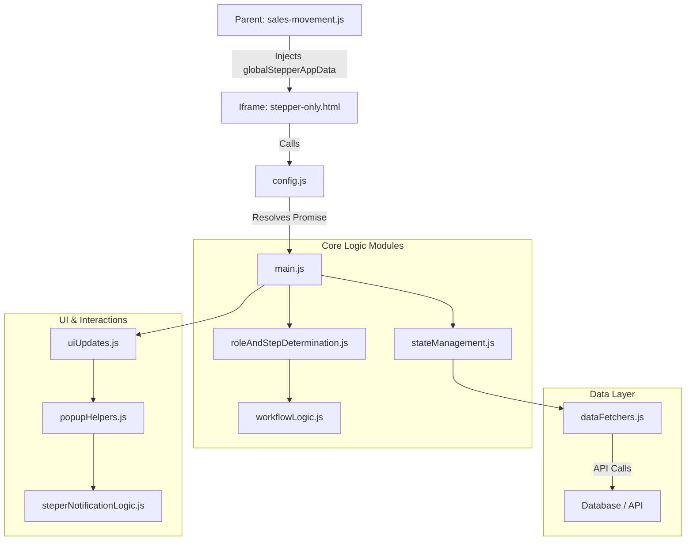

# تفاصيل نظام شريط التقدم (Stepper Details)

يوضح هذا المستند التفاصيل التقنية والوظيفية لنظام شريط التقدم (Stepper) المستخدم في صفحة حركة المبيعات، بناءً على الهيكلية البرمجية الحالية في مجلد `steper/`.

---

## 1. حالات العناصر (Item Statuses)
يوفر النظام 7 حالات أساسية لكل منتج داخل الطلب، ويتم التحكم بها عبر `steper/config.js`:

| الحالة | الرمز (Status Key) | الوصف |
| :--- | :--- | :--- |
| **معلق** | `PENDING` | الحالة الافتراضية عند بدء الطلب أو مراجعته. |
| **مؤكد** | `CONFIRMED` | المنتج متوفر ومقبول من قبل البائع. |
| **مشحون** | `SHIPPED` | تم تسليم المنتج للمندوب أو شحنه فعلياً. |
| **تم التسليم** | `DELIVERED` | استلم المشتري المنتج وأكّد ذلك. |
| **ملغي** | `CANCELLED` | منتج تم إلغاؤه من قبل المشتري أثناء المراجعة. |
| **مرفوض** | `REJECTED` | منتج تم رفضه من قبل البائع (غير متوفر). |
| **مرتجع** | `RETURNED` | منتج وصل للمشتري ولكن لم يتم استلامه (تم إرجاعه). |

---

## 2. مصفوفة الصلاحيات والوصول (Roles & Permissions)
يتم تحديد دور المستخدم في `steper/roleAndStepDetermination.js` بالترتيب: Admin > Seller > Buyer > Courier.

| الدور | الصلاحية | ملاحظات |
| :--- | :--- | :--- |
| **المسؤول (Admin)** | تحكم كامل (Full Access) | يمكنه تعديل أي مرحلة، وتجاوز جميع الأقفال (Override Locks). يتم التعرف عليهم عبر `ADMIN_IDS`. |
| **المشتري (Buyer)** | مراجعة وتسليم | يتحكم في مرحلتي `Review` (المراجعة) و `Delivered` (التسليم). |
| **البائع (Seller)** | تأكيد وشحن | يتحكم في مرحلتي `Confirmed` (التأكيد) و `Shipped` (الشحن) للمنتجات الخاصة به فقط. |
| **المندوب (Courier)** | شحن وتسليم | يشاهد تفاصيل البائعين لتجميع الطلبات، ويؤكد الشحن أو التسليم. |

### 2.1. خوارزمية تحديد الدور (Role Determination Algorithm)
تعتمد دالة `determineUserType` في `roleAndStepDetermination.js` على منطق دقيق لتجنب تضارب الصلاحيات:

1.  **المسؤول (Admin):** يتم التحقق أولاً من مصفوفة `ADMIN_IDS` في `config.js`. إذا كان المستخدم فيها، يُمنح صلاحية `admin` فوراً.
2.  **البائع (Seller):** يتم البحث داخل `order_items`. إذا وجد أن `seller_key` للعنصر يطابق معرف المستخدم الحالي، يتم اعتباره بائعاً.
3.  **المشتري (Buyer):** يتم البحث في بيانات الطلب `ordersData`. إذا كان `user_key` يطابق معرف المستخدم، يتم اعتباره مشترياً.
4.  **المندوب (Courier):**
    *   يتم فحص حقل `supplier_delivery` لكل عنصر.
    *   يدعم النظام أن يكون هذا الحقل كائناً `{ delivery_key: '...' }` أو مصفوفة.
    *   يتم استخراج `delivery_key` ومطابقته مع المستخدم الحالي.
5.  **معالجة التضارب:**
    *   إذا اكتشف النظام أن المستخدم هو "بائع" و"مشتري" في نفس الوقت لنفس الطلب (وهو خطأ منطقي)، يتم إرجاع `null` وتسجيل خطأ `Fatal Error`.
    *   الأولوية في الترتيب: المسؤول > البائع > المشتري > المندوب.

---

## 3. مراحل الطلب (Steps Timeline)

| # | المرحلة (Step) | الوظيفة | آلية التفعيل (Activation) |
| :--- | :--- | :--- | :--- |
| **1** | **مراجعة (Review)** | تحديد المنتجات المطلوب شراؤها. | تلقائية عند إنشاء الطلب. |
| **2** | **تأكيد (Confirmed)** | تأكيد البائعين لتوفر المنتجات. | يدوياً عبر مفتاح (Activate Step) في النافذة. |
| **3** | **شحن (Shipped)** | تأكيد خروج المنتجات للشحن. | يدوياً، تتطلب أن تكون المرحلة 2 مفعلة. |
| **4** | **توصيل (Delivered)** | التأكيد النهائي للاستلام. | يدوياً، تتطلب أن تكون المرحلة 3 مفعلة. |

> [!IMPORTANT]
> **تسلسل المراحل:** لا يمكن تفعيل مرحلة إلا إذا كانت المرحلة السابقة لها مفعلة (Sequence: 1 -> 2 -> 3 -> 4) عبر دالة `validateStepSequence`.

---

## 4. الهيكلية البرمجية (Modular Architecture)
تم تقسيم الكود إلى وحدات (Modules) لسهولة الصيانة:

*   **Controllers (المتحكمات):** يوجد في `buyerPopups/` و `sellerPopups/` للتحكم في منطق فتح النوافذ وحفظ البيانات.
*   **Logic (المنطق):** `buyerLogic.js` و `sellerLogic.js` لمعالجة البيانات (Pure Functions).
*   **UI (الواجهات):** `buyerUi.js` و `sellerUi.js` لتوليد كود HTML الخاص بالنوافذ.
*   **State:** `stateManagement.js` لإدارة حالة الطلب في الذاكرة ومزامنته مع السيرفر.
*   **Data Fetchers:** `dataFetchers.js` للتعامل مع الـ API والتواصل مع قاعدة البيانات.

---

## 5. آلية قفل البيانات (Lock Mechanisms)
لمنع التلاعب بعد الحفظ النهائي، يتم قفل المراحل لكل مستخدم بشكل مستقل:

*   **قفل التأكيد:** `__confirmation_locked_{sellerId}__` - يمنع البائع من تغيير رأيه بعد تأكيد المنتجات.
*   **قفل الشحن:** `__shipping_locked_{userId}__` - يمنع البائع/المندوب من تعديل حالة الشحن بعد الحفظ.
*   **قفل التسليم:** `__delivery_locked_{userId}__` - يمنع المشتري من تعديل حالة الاستلام بعد الحفظ.

> [!TIP]
> المسؤول (Admin) هو الوحيد الذي تظهر له الأزرار حتى لو كانت المرحلة مقفلة، مما يتيح له التعديل في حالات الطوارئ.

---

## 6. ميزات خاصة (Special Features)

### رابط صور الطلب الخاص (Photo Link)
في ملف `stepper-only.html` تم إضافة منطق خاص:
إذا كان إجمالي الطلب (`total_amount`) يساوي **0**، يظهر زر "عرض صور الطلب الخاص" أعلى الشريط. هذا يسمح للمستخدم بمشاهدة صور الموفير أو الطلبات التي تم الاتفاق عليها خارج النظام التقليدي.

### التمرير التلقائي (Auto-Scroll Tutorial)
عند فتح صفحة الـ Stepper لأول مرة (أو مرتين)، يقوم الشريط بالتمرير تلقائياً لليمين واليسار لتعريف المستخدم بوجود مراحل أخرى يمكن الوصول إليها بالسحب.

---

---

## 7. بناء وتدفق بيانات Steper (Server Data Structure & Flow)

يعتمد النظام حالياً على مبدأ **"الخادم هو المصدر الوحيد للحقيقة" (Single Source of Truth)**. تم إلغاء التخزين المحلي بالكامل، ولا تتغير حالة الواجهة إلا بعد استلام رد `200 OK` من السيرفر.

### هيكلية حقل `order_status`
يتم تخزين جميع الحالات داخل حقل نصي مركب في قاعدة البيانات بصيغة:
`StepID # Timestamp # JSON_Blob`

| المكون | الوصف | مثال |
| :--- | :--- | :--- |
| **StepID** | معرف آخر مرحلة رئيسية مفعلة. | `step-confirmed` |
| **Timestamp** | توقيت آخر تحديث للنظام. | `2024-12-21T09:00:00.000Z` |
| **JSON_Blob** | كائن مرن يحتوي على الحالات التقنية والأقفال والتواريخ. | انظر المثال أدناه |

### محتويات الـ `JSON_Blob` المتوقعة:
```json
{
  "1734057973789": "confirmed",
  "1734057973790": "rejected",
  "__confirmation_locked_1024182175__": "locked",
  "__confirmation_locked_5502654655__": "locked",
  "__shipping_locked_1024182175__": "locked",
  "__date_step-confirmed__": "2024-12-15 10:00 PM",
  "__date_step-shipped__": "2024-12-16 09:30 AM"
}
```

### سيناريوهات تدفق البيانات:

1.  **تحميل الصفحة (Initialization):**
    *   يتم استلام `order_status` وتفكيكه في `stateManagement.js`.
    *   يتم توزيع حالات المنتجات على الذاكرة المحلية وتعبئة تواريخ الـ Timeline بناءً على مفاتيح `__date_`.

2.  **حفظ التغييرات (Saving Updates):**
    *   عند تغيير حالة منتج أو قفل مرحلة، يتم إرسال طلب `POST` للسيرفر.
    *   يتم دمج (Merge) القيم الجديدة في الـ JSON الموجود حالياً في قاعدة البيانات لضمان عدم ضياع بيانات المستخدمين الآخرين.

3.  **تفعيل مرحلة (Step Activation):**
    *   يتم تسجيل "تاريخ التفعيل" تحت مفتاح `__date_{stepId}__` وحفظه في الـ Blob.
    *   تتحول حالة المرحلة في شريط التقدم إلى "نشطة" (Active) ويظهر التاريخ تحتها.

4.  **معالجة الأخطاء (Error Handling):**
    *   في حال فشل الاتصال، لا يتم تحديث الذاكرة المحلية أو الواجهة، وتظهر رسالة خطأ للمستخدم (Swal)، مما يضمن التطابق التام مع حالة السيرفر.

---

## 8. التعريب ودعم اللغة العربية (Localization & Arabic Support)

تم تصميم النظام ليدعم اللغة العربية بشكل كامل (RTL) في كافة النوافذ المنبثقة والواجهات، مع سياسة تعريب صارمة تمنع ظهور المصطلحات الإنجليزية للمستخدم النهائي.

### آلية ترجمة الحالات (Status Translation)
يتم تخزين الحالات برمجياً بالإنجليزية (مثل `pending`) لضمان استقرار قاعدة البيانات، ولكن يتم عرضها بالعربية للمستخدم عبر:
*   **قاموس الترجمة الموحد:** `ITEM_STATUS_ARABIC` في `config.js`.
*   **دالة التحويل:** `translateStatus(status)` في `commonUtils.js` التي تقوم بتحويل أي مفتاح تقني إلى مقابله العربي.

### تعريب الوقت والتاريخ
تستخدم دالة `formatDate` في `uiUpdates.js` نظام توقيت عربي:
*   تحويل `AM` إلى **"ص"**.
*   تحويل `PM` إلى **"م"**.
*   التاريخ يظهر بصيغة `YYYY-MM-DD` متبوعاً بالوقت بصيغة 12 ساعة.

### نصوص الواجهة (UI Strings)
تم تعريب كافة الرسائل العارضة داخل ملفات `buyerUi.js` و `sellerUi.js` لضمان تجربة مستخدم خالية من أي كلمات إنجليزية، بما في ذلك رسائل "لا توجد منتجات" وتنبيهات الحفظ.

---

## 9. تفاصيل دورة حياة البيانات (Data LifeCycle Deep Dive)

يوضح هذا القسم الرحلة الكاملة للبيانات من قاعدة البيانات حتى وصولها إلى واجهة الـ Stepper.

### 9.1. الجلب والتحضير في النافذة الأم (Parent Window Fetch & Prepare)
المصدر: `pages/sales-movement/sales-movement.js`

1.  **الجلب (Fetching):**
    *   يتم استدعاء API: `/api/user-all-orders`.
    *   يتم تمرير المعاملات: `user_key` (معرف المستخدم) و `role` (الدور المحدد: purchaser, seller, delivery, admin).
    *   يتم جلب بيانات الطلب "الطازجة" لضمان دقة الحالة قبل العرض.

2.  **التحويل (Transformation):**
    *   تقوم دالة `salesMovement_showOrderDetails` بمعالجة البيانات الخام.
    *   يتم تسطيح (Flattening) كائن الطلب ليتوافق مع بنية الـ Stepper.
    *   يتم معالجة حقل `supplier_delivery` المعقد (الذي قد يكون `null`، كائن، أو مصفوفة) وتوحيده لضمان استقرار الكود.

3.  **الحقن (Injection):**
    *   قبل إنشاء الـ Iframe، يتم إنشاء كائن عالمي في النافذة الأم:
        ```javascript
        window.globalStepperAppData = {
            idUser: userSession.user_key,
            ordersData: [convertedOrder], // مصفوفة تحتوي الطلب المحول
            baseURL: baseURL
        };
        ```
    *   هذا الكائن هو "الجسر" الذي سينقل البيانات إلى الـ Iframe.

### 9.2. الجسر والتهيئة في الـ Iframe (Iframe Bridging & Init)
المصدر: `steper/stepper-only.html` و `steper/config.js`

1.  **التحقق من الجسر (Bridge Check):**
    *   عند تحميل `DOMContentLoaded` في الـ Iframe، يتم فحص `window.parent.globalStepperAppData`.
    *   إذا وجدت البيانات، يتم استدعاء دالة التهيئة.

2.  **وعد التهيئة (Initialization Promise):**
    *   في ملف `config.js`، يوجد `initializationPromise` معلق.
    *   تنتظر بقية ملفات النظام (مثل `main.js` و `dataFetchers.js`) حل هذا الوعد.
    *   عند استلام البيانات من النافذة الأم، يتم استدعاء `setOrdersData` و `setAppDataControl` ثم حل الوعد (`resolve()`).
    *   هذا يضمن عدم تشغيل أي منطق قبل وصول البيانات.

---

## 10. مخطط هيكلية المكونات (Component Architecture)

يوضح المخطط التالي العلاقات بين ملفات النظام وكيفية تدفق التحكم:



