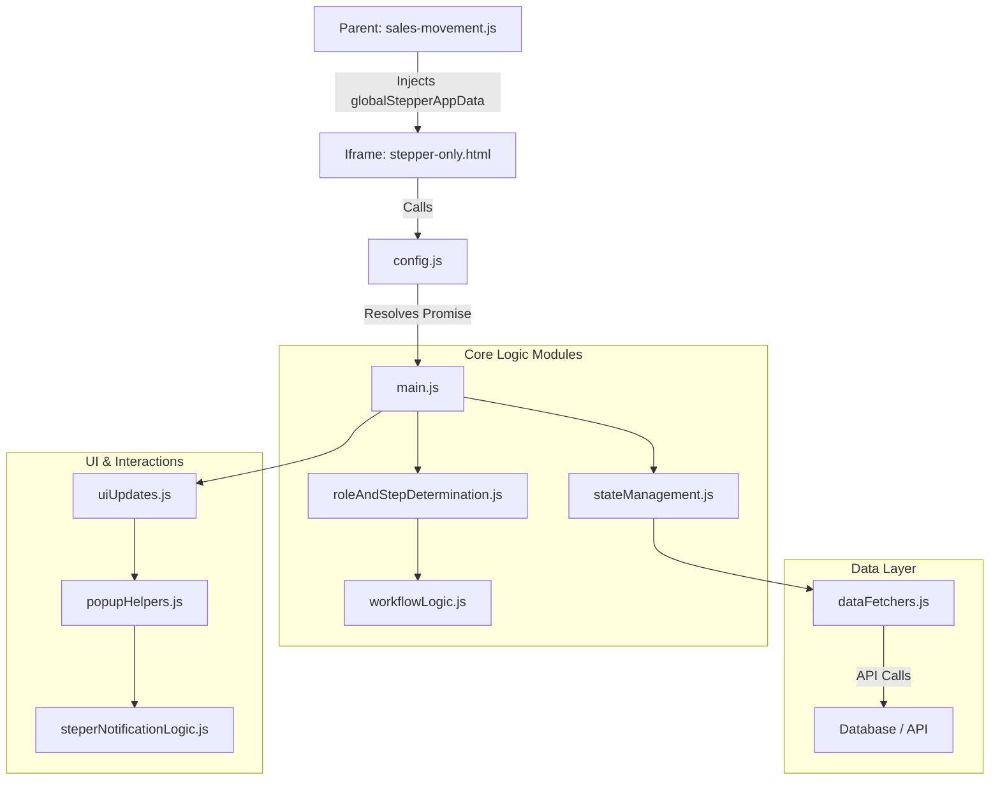

# تفاصيل نظام شريط التقدم (Stepper Details)

يوضح هذا المستند التفاصيل التقنية والوظيفية لنظام شريط التقدم (Stepper) المستخدم في صفحة حركة المبيعات، بناءً على الهيكلية البرمجية الحالية في مجلد `steper/`.

---

## 1. حالات العناصر (Item Statuses)
يوفر النظام 7 حالات أساسية لكل منتج داخل الطلب، ويتم التحكم بها عبر `steper/config.js`:

| الحالة | الرمز (Status Key) | الوصف |
| :--- | :--- | :--- |
| **معلق** | `PENDING` | الحالة الافتراضية عند بدء الطلب أو مراجعته. |
| **مؤكد** | `CONFIRMED` | المنتج متوفر ومقبول من قبل البائع. |
| **مشحون** | `SHIPPED` | تم تسليم المنتج للمندوب أو شحنه فعلياً. |
| **تم التسليم** | `DELIVERED` | استلم المشتري المنتج وأكّد ذلك. |
| **ملغي** | `CANCELLED` | منتج تم إلغاؤه من قبل المشتري أثناء المراجعة. |
| **مرفوض** | `REJECTED` | منتج تم رفضه من قبل البائع (غير متوفر). |
| **مرتجع** | `RETURNED` | منتج وصل للمشتري ولكن لم يتم استلامه (تم إرجاعه). |

---

## 2. مصفوفة الصلاحيات والوصول (Roles & Permissions)
يتم تحديد دور المستخدم في `steper/roleAndStepDetermination.js` بالترتيب: Admin > Seller > Buyer > Courier.

| الدور | الصلاحية | ملاحظات |
| :--- | :--- | :--- |
| **المسؤول (Admin)** | تحكم كامل (Full Access) | يمكنه تعديل أي مرحلة، وتجاوز جميع الأقفال (Override Locks). يتم التعرف عليهم عبر `ADMIN_IDS`. |
| **المشتري (Buyer)** | مراجعة وتسليم | يتحكم في مرحلتي `Review` (المراجعة) و `Delivered` (التسليم). |
| **البائع (Seller)** | تأكيد وشحن | يتحكم في مرحلتي `Confirmed` (التأكيد) و `Shipped` (الشحن) للمنتجات الخاصة به فقط. |
| **المندوب (Courier)** | شحن وتسليم | يشاهد تفاصيل البائعين لتجميع الطلبات، ويؤكد الشحن أو التسليم. |

### 2.1. خوارزمية تحديد الدور (Role Determination Algorithm)
تعتمد دالة `determineUserType` في `roleAndStepDetermination.js` على منطق دقيق لتجنب تضارب الصلاحيات:

1.  **المسؤول (Admin):** يتم التحقق أولاً من مصفوفة `ADMIN_IDS` في `config.js`. إذا كان المستخدم فيها، يُمنح صلاحية `admin` فوراً.
2.  **البائع (Seller):** يتم البحث داخل `order_items`. إذا وجد أن `seller_key` للعنصر يطابق معرف المستخدم الحالي، يتم اعتباره بائعاً.
3.  **المشتري (Buyer):** يتم البحث في بيانات الطلب `ordersData`. إذا كان `user_key` يطابق معرف المستخدم، يتم اعتباره مشترياً.
4.  **المندوب (Courier):**
    *   يتم فحص حقل `supplier_delivery` لكل عنصر.
    *   يدعم النظام أن يكون هذا الحقل كائناً `{ delivery_key: '...' }` أو مصفوفة.
    *   يتم استخراج `delivery_key` ومطابقته مع المستخدم الحالي.
5.  **معالجة التضارب:**
    *   إذا اكتشف النظام أن المستخدم هو "بائع" و"مشتري" في نفس الوقت لنفس الطلب (وهو خطأ منطقي)، يتم إرجاع `null` وتسجيل خطأ `Fatal Error`.
    *   الأولوية في الترتيب: المسؤول > البائع > المشتري > المندوب.

---

## 3. مراحل الطلب (Steps Timeline)

| # | المرحلة (Step) | الوظيفة | آلية التفعيل (Activation) |
| :--- | :--- | :--- | :--- |
| **1** | **مراجعة (Review)** | تحديد المنتجات المطلوب شراؤها. | تلقائية عند إنشاء الطلب. |
| **2** | **تأكيد (Confirmed)** | تأكيد البائعين لتوفر المنتجات. | يدوياً عبر مفتاح (Activate Step) في النافذة. |
| **3** | **شحن (Shipped)** | تأكيد خروج المنتجات للشحن. | يدوياً، تتطلب أن تكون المرحلة 2 مفعلة. |
| **4** | **توصيل (Delivered)** | التأكيد النهائي للاستلام. | يدوياً، تتطلب أن تكون المرحلة 3 مفعلة. |

> [!IMPORTANT]
> **تسلسل المراحل:** لا يمكن تفعيل مرحلة إلا إذا كانت المرحلة السابقة لها مفعلة (Sequence: 1 -> 2 -> 3 -> 4) عبر دالة `validateStepSequence`.

---

## 4. الهيكلية البرمجية (Modular Architecture)
تم تقسيم الكود إلى وحدات (Modules) لسهولة الصيانة:

*   **Controllers (المتحكمات):** يوجد في `buyerPopups/` و `sellerPopups/` للتحكم في منطق فتح النوافذ وحفظ البيانات.
*   **Logic (المنطق):** `buyerLogic.js` و `sellerLogic.js` لمعالجة البيانات (Pure Functions).
*   **UI (الواجهات):** `buyerUi.js` و `sellerUi.js` لتوليد كود HTML الخاص بالنوافذ.
*   **State:** `stateManagement.js` لإدارة حالة الطلب في الذاكرة ومزامنته مع السيرفر.
*   **Data Fetchers:** `dataFetchers.js` للتعامل مع الـ API والتواصل مع قاعدة البيانات.

---

## 5. آلية قفل البيانات (Lock Mechanisms)
لمنع التلاعب بعد الحفظ النهائي، يتم قفل المراحل لكل مستخدم بشكل مستقل:

*   **قفل التأكيد:** `__confirmation_locked_{sellerId}__` - يمنع البائع من تغيير رأيه بعد تأكيد المنتجات.
*   **قفل الشحن:** `__shipping_locked_{userId}__` - يمنع البائع/المندوب من تعديل حالة الشحن بعد الحفظ.
*   **قفل التسليم:** `__delivery_locked_{userId}__` - يمنع المشتري من تعديل حالة الاستلام بعد الحفظ.

> [!TIP]
> المسؤول (Admin) هو الوحيد الذي تظهر له الأزرار حتى لو كانت المرحلة مقفلة، مما يتيح له التعديل في حالات الطوارئ.

---

## 6. ميزات خاصة لطلبات الخدمات (Special Service Features)

### 6.1. تذييل الخدمة (Order Service Footer)
يظهر في أسفل الـ Stepper لطلبات الخدمات فقط (`orderType === 1`) ويحتوي على:
*   **رابط الصور:** يسمح بمشاهدة مرفقات الطلب الخاص.
*   **حقل القيمة (Order Value Input):** حقل رقمي لعرض وتعديل إجمالي مبلغ الطلب.
*   **زر الحفظ:** زر مخصص لاعتماد القيمة في السيرفر.

### 6.2. إدارة السعر والأقفال الذكية (Price Management & Smart Locks)
يرتبط حقل القيمة بعمود `total_amount` في قاعدة البيانات ويخضع لقواعد صارمة:
*   **نافذة التأكيد:** عند النقر على حفظ، تظهر نافذة `SweetAlert2` لتأكيد القيمة قبل إرسالها للسيرفر.
*   **القفل التلقائي للبائع:** يتم قفل الحقل (Read-only) وتعطيل زر الحفظ للبائع فور انتقال الطلب لمرحلة **"مؤكد" (Confirmed)** أو ما بعدها. يظهر تنبيه "القيمة مقفلة بعد التأكيد" عند محاولة التفاعل.
*   **صلاحية المسؤول (Admin):** المسؤول هو الوحيد الذي يحتفظ بصلاحية تعديل وحفظ القيمة في أي وقت، حتى بعد تأكيد الطلب، لتصحيح الأخطاء.
*   **المشتري والمندوب:** الحقل متاح لهم للمشاهدة فقط ولا يمكنهم التفاعل معه نهائياً.

### 6.3. التمرير التلقائي (Auto-Scroll Tutorial)
عند فتح صفحة الـ Stepper لأول مرة (أو مرتين)، يقوم الشريط بالتمرير تلقائياً لليمين واليسار لتعريف المستخدم بوجود مراحل أخرى يمكن الوصول إليها بالسحب.

---

---

## 7. بناء وتدفق بيانات Steper (Server Data Structure & Flow)

يعتمد النظام حالياً على مبدأ **"الخادم هو المصدر الوحيد للحقيقة" (Single Source of Truth)**. تم إلغاء التخزين المحلي بالكامل، ولا تتغير حالة الواجهة إلا بعد استلام رد `200 OK` من السيرفر.

### هيكلية حقل `order_status`
يتم تخزين جميع الحالات داخل حقل نصي مركب في قاعدة البيانات بصيغة:
`StepID # Timestamp # JSON_Blob`

| المكون | الوصف | مثال |
| :--- | :--- | :--- |
| **StepID** | معرف آخر مرحلة رئيسية مفعلة. | `step-confirmed` |
| **Timestamp** | توقيت آخر تحديث للنظام. | `2024-12-21T09:00:00.000Z` |
| **JSON_Blob** | كائن مرن يحتوي على الحالات التقنية والأقفال والتواريخ. | انظر المثال أدناه |

### محتويات الـ `JSON_Blob` المتوقعة:
```json
{
  "1734057973789": "confirmed",
  "1734057973790": "rejected",
  "__confirmation_locked_1024182175__": "locked",
  "__confirmation_locked_5502654655__": "locked",
  "__shipping_locked_1024182175__": "locked",
  "__date_step-confirmed__": "2024-12-15 10:00 PM",
  "__date_step-shipped__": "2024-12-16 09:30 AM"
}
```

### سيناريوهات تدفق البيانات:

1.  **تحميل الصفحة (Initialization):**
    *   يتم استلام `order_status` وتفكيكه في `stateManagement.js`.
    *   يتم توزيع حالات المنتجات على الذاكرة المحلية وتعبئة تواريخ الـ Timeline بناءً على مفاتيح `__date_`.

2.  **حفظ التغييرات (Saving Updates):**
    *   عند تغيير حالة منتج أو قفل مرحلة، يتم إرسال طلب `POST` للسيرفر.
    *   يتم دمج (Merge) القيم الجديدة في الـ JSON الموجود حالياً في قاعدة البيانات لضمان عدم ضياع بيانات المستخدمين الآخرين.

3.  **تفعيل مرحلة (Step Activation):**
    *   يتم تسجيل "تاريخ التفعيل" تحت مفتاح `__date_{stepId}__` وحفظه في الـ Blob.
    *   تتحول حالة المرحلة في شريط التقدم إلى "نشطة" (Active) ويظهر التاريخ تحتها.

4.  **معالجة الأخطاء (Error Handling):**
    *   في حال فشل الاتصال، لا يتم تحديث الذاكرة المحلية أو الواجهة، وتظهر رسالة خطأ للمستخدم (Swal)، مما يضمن التطابق التام مع حالة السيرفر.

---

## 8. التعريب ودعم اللغة العربية (Localization & Arabic Support)

تم تصميم النظام ليدعم اللغة العربية بشكل كامل (RTL) في كافة النوافذ المنبثقة والواجهات، مع سياسة تعريب صارمة تمنع ظهور المصطلحات الإنجليزية للمستخدم النهائي.

### آلية ترجمة الحالات (Status Translation)
يتم تخزين الحالات برمجياً بالإنجليزية (مثل `pending`) لضمان استقرار قاعدة البيانات، ولكن يتم عرضها بالعربية للمستخدم عبر:
*   **قاموس الترجمة الموحد:** `ITEM_STATUS_ARABIC` في `config.js`.
*   **دالة التحويل:** `translateStatus(status)` في `commonUtils.js` التي تقوم بتحويل أي مفتاح تقني إلى مقابله العربي.

### تعريب الوقت والتاريخ
تستخدم دالة `formatDate` في `uiUpdates.js` نظام توقيت عربي:
*   تحويل `AM` إلى **"ص"**.
*   تحويل `PM` إلى **"م"**.
*   التاريخ يظهر بصيغة `YYYY-MM-DD` متبوعاً بالوقت بصيغة 12 ساعة.

### نصوص الواجهة (UI Strings)
تم تعريب كافة الرسائل العارضة داخل ملفات `buyerUi.js` و `sellerUi.js` لضمان تجربة مستخدم خالية من أي كلمات إنجليزية، بما في ذلك رسائل "لا توجد منتجات" وتنبيهات الحفظ.

---

## 9. تفاصيل دورة حياة البيانات (Data LifeCycle Deep Dive)

يوضح هذا القسم الرحلة الكاملة للبيانات من قاعدة البيانات حتى وصولها إلى واجهة الـ Stepper.

### 9.1. المسؤولية الأساسية وحقن البيانات (Primary Responsibility & Data Injection)

تُعد صفحة [`pages/sales-movement/sales-movement.js`](file:///c:/Users/hesham/bazaar/pages/sales-movement/sales-movement.js) هي **المسؤول الأساسي والمحرك الأول** لدورة حياة البيانات داخل الـ Stepper. لا يقوم نظام الـ Stepper بجلب بيانات الطلبات من السيرفر بشكل مستقل عند البدء، بل يعتمد كلياً على البيانات التي يتم تحضيرها وحقنها من صفحة حركة المبيعات.

#### المهام الرئيسية التي تقوم بها `sales-movement.js`:

1.  **الجلب الطازج (Fresh Fetching):**
    *   عند النقر على أي طلب، تقوم الصفحة بجلب أحدث نسخة من البيانات عبر API: `/api/user-all-orders`.
    *   تضمن هذه الخطوة أن الـ Stepper سيعرض الحالة الحقيقية والنهائية للطلب (Real-time Sync).

2.  **تحديد نوع الطلب (Order Type Identification):**
    *   تقوم الصفحة بتمرير حقل `orderType` (0 للمنتجات، 1 للخدمات).
    *   هذا الحقل هو المسؤول عن تغيير سلوك الـ Stepper برمجياً (مثل إظهار أو إخفاء رابط الصور وأدوات التسعير).

3.  **التحويل والتوحيد (Data Transformation):**
    *   تقوم دالة `salesMovement_showOrderDetails` بتجهيز كائن `convertedOrder`.
    *   يتم معالجة التناقضات في البيانات (مثل حقل `supplier_delivery`) لضمان وصول بيانات موحدة لا تسبب أعطالاً داخل الـ Iframe.

4.  **إنشاء الجسر التقني (Technical Bridging):**
    *   يتم حقن البيانات عبر الكائن العالمي `window.globalStepperAppData` في النافذة الأب (Parent Window).
    *   يحتوي هذا الكائن على معرف المستخدم (`idUser`) ومصفوفة الطلبات (`ordersData`) والرابط الأساسي (`baseURL`).

> [!IMPORTANT]
> أي خلل في إرسال البيانات من صفحة حركة المبيعات سيؤدي مباشرة إلى توقف الـ Stepper عن العمل أو عرضه لبيانات غير دقيقة، حيث أنه يعمل كمستقبل (Receiver) سلبي للبيانات.

### 9.2. الجسر والتهيئة في الـ Iframe (Iframe Bridging & Init)
المصدر: `steper/stepper-only.html` و `steper/config.js`

1.  **التحقق من الجسر (Bridge Check):**
    *   عند تحميل `DOMContentLoaded` في الـ Iframe، يتم فحص `window.parent.globalStepperAppData`.
    *   إذا وجدت البيانات، يتم استدعاء دالة التهيئة.

2.  **وعد التهيئة (Initialization Promise):**
    *   في ملف `config.js`، يوجد `initializationPromise` معلق.
    *   تنتظر بقية ملفات النظام (مثل `main.js` و `dataFetchers.js`) حل هذا الوعد.
    *   عند استلام البيانات من النافذة الأم، يتم استدعاء `setOrdersData` و `setAppDataControl` ثم حل الوعد (`resolve()`).
    *   هذا يضمن عدم تشغيل أي منطق قبل وصول البيانات.

---

## 10. مخطط هيكلية المكونات (Component Architecture)

يوضح المخطط التالي العلاقات بين ملفات النظام وكيفية تدفق التحكم:



---

## 11. دليل جودة وسلامة البيانات (Data Integrity & Quality Guide)

لضمان عدم تكرار أخطاء فقدان الحقول البرمجية (مثل `orderType`) وضمان استقرار النظام عند التوسع المستقبلي، يجب اتباع القواعد التالية عند التعامل مع بيانات الـ Stepper:

### 11.1. مبدأ الصراحة في الاستعلام (Explicit SQL Queries)
*   **القاعدة:** تجنب استخدام `SELECT *` في الـ APIs.
*   **السبب:** استخدام `SELECT *` قد ينجح محلياً ولكنه قد يفشل في بيئة Edge Functions أو يتأثر بتغييرات هيكلية قاعدة البيانات.
*   **الممارسة الفضلى:** قم بتسمية كل عمود تحتاجه صراحة (مثل `SELECT o.order_key, o.orderType ...`). هذا يضمن أن الحقل سيتم تضمينه في الاستجابة دائماً وبشكل متوقع.

### 11.2. تتبع سلسلة انتقال الحقول (Detailed Chain of Responsibility)

لضمان وصول أي حقل (مثل `orderType`) من قاعدة البيانات إلى واجهة الـ Stepper، يجب مراقبة انتقال البيانات عبر المحطات التالية:

| المحطة | الملف (File Path) | الدالة البرمجية (Function) | شكل البيانات المتوقع (Data Shape) |
| :--- | :--- | :--- | :--- |
| **1. السيرفر** | `api/user-all-orders.js` | `handler(request)` | كائن JSON خام يحتوي على الحقل مباشرة من SQL: `{"orderType": 1, ...}` |
| **2. الاندماج** | `pages/sales-movement/sales-movement.js` | `salesMovement_showOrderDetails` | كائن `convertedOrder` يتم فيه تحويل الحقول لتطابق بنية الـ Stepper. |
| **3. الجسر** | `pages/sales-movement/sales-movement.js` | (حقن مباشر) | كائن عالمي: `window.globalStepperAppData.ordersData[0].orderType` |
| **4. الاستقبال** | `steper/config.js` | `setOrdersData(data)` | المتغير المصدر للـ Stepper: `export let ordersData = [...]` |
| **5. التنفيذ** | `steper/stepper-only.html` | `initPhotoLink()` | قراءة الحقل برمجياً: `const type = ordersData[0].orderType;` |

#### مثال تطبيقي لشكل البيانات (JSON Path):

*   **من السيرفر ( raw ):**
    ```json
    { "order_key": "O-123", "orderType": 1, "total_amount": 0 }
    ```
*   **داخل صفحة حركة المبيعات ( Processed ):**
    ```javascript
    // يتم التجميع في مصفوفة لأن الـ Stepper يدعم عرض عدة طلبات
    window.globalStepperAppData.ordersData = [
       { "order_key": "O-123", "orderType": 1, "order_items": [...] }
    ];
    ```
*   **داخل الـ Stepper ( Runtime ):**
    ```javascript
    import { ordersData } from './config.js';
    console.log(ordersData[0].orderType); // النتيجة: 1
    ```

### 11.3. البرمجة الدفاعية والتحقق المزدوج (Defensive Programming)
*   **القاعدة:** لا تعتمد على حقل واحد فقط إذا كان هناك بديل منطقي.
*   **الممارسة الفضلى:** استخدم "التحقق المزدوج" (Double Check). على سبيل المثال، إذا كان النظام يعتمد على `orderType` لتحديد نوع الخدمة، أضف فحصاً احتياطياً على محتويات الطلب (`serviceType` لكل عنصر). هذا يضمن عمل النظام حتى مع وجود بيانات قديمة أو غير مكتملة.

### 11.4. التعامل مع حالة الأحرف (Case Sensitivity)
*   تتعامل بعض محركات البيانات (مثل SQLite في بعض الظروف) مع أسماء الأعمدة بحالة أحرف صغيرة فقط (`ordertype` بدلاً من `orderType`).
*   **الممارسة الفضلى:** عند قراءة الحقول الهامة، استخدم منطقاً مرناً:
    `const type = order.orderType ?? order.ordertype;`

### 11.5. التوثيق والاختبار (Verification)
قبل اعتماد أي تغيير في تدفق البيانات، استخدم `console.log` في محطتين أساسيتين:
*   داخل الـ API للتأكد من خروج البيانات.
*   داخل الـ Stepper للتأكد من وصول البيانات وفهم المتصفح لنوعها (نصي أم عددي).

> [!TIP]
> تذكر دائماً: الـ Stepper هو مجرد "مرآة" لما ترسل له صفحة حركة المبيعات؛ فإذا كانت المرآة لا تظهر شيئاً، فالمشكلة غالباً في "الضوء" القادم من السيرفر.

